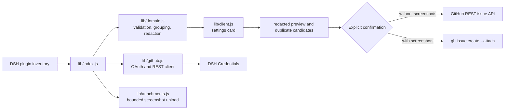

# dsh-issue-reporter

<div align="center">

<h3>Safe, user-owned GitHub bug reports from DeepSeek Harness</h3>

<p align="center">
  <a href="https://www.npmjs.com/package/@goodandready/dsh-issue-reporter"></a>
  <a href="https://github.com/GooDAnDReaDY/dsh-issue-reporter/blob/main/LICENSE"></a>
  <a href="https://github.com/topics/dsh-plugin"></a>
  <a href="https://nodejs.org"></a>
</p>

<p align="center">
  <a href="https://goodandready.app/"></a>
</p>

<p align="center">
  <a href="README.md"><b>🇬🇧 English</b></a> •
  <a href="README.zh.md"><b>🇨🇳 中文说明</b></a> •
  <a href="README.ru.md"><b>🇷🇺 Русский</b></a>
</p>

<table align="center">
  <tr>
    <td align="center">
      ⭐ <strong>If you like this plugin, please star it on GitHub</strong> — it shows me that the plugin is useful to you and motivates me to keep developing it.
      <br><br>
      🐛 <strong>If you find a bug or would like to request a feature</strong>, open a GitHub issue in any language — I will review your proposal and implement useful suggestions in a future plugin version.
    </td>
  </tr>
</table>

</div>

Create actionable GitHub issues from DeepSeek Harness with user-owned context and privacy controls.

The settings card discovers installed plugins from the current DSH composition and separates them into two independently collapsible groups:

- Native DSH plugins with the @deepseek-ai/ package scope.
- Third-party plugins from every other package scope.

Users choose a supported plugin, complete a report, review the redacted preview and possible duplicates, and explicitly confirm before an issue is created. GitHub authorization is started from a single "Sign in with GitHub" action. The technical OAuth App Device Flow client id, credential reference and API URL are installation configuration, not user-facing form fields.

When a GitHub account is connected, the authorization section also shows "Sign out". It removes the stored OAuth material from DSH Credentials; after signing out, the user can sign in as another account.

The report editor can optionally attach up to five PNG, JPG, GIF, or WebP screenshots. Attachments remain in the browser until the explicit confirmation and are uploaded with the official GitHub CLI attachment flow (gh 2.99 or newer) in a temporary directory that is removed afterward. GitHub App tokens cannot upload attachments through this flow; use a GitHub OAuth App token or a personal access token for screenshot reports. Reports without screenshots continue to use the GitHub REST API.

Without a configured GitHub OAuth App client id, the plugin explains that sign-in is unavailable. Without an authorized account, it keeps the prefilled issue-form fallback available.

The reporter follows the native DSH settings interaction: click the full reporter header row to expand or collapse it, then click a supported plugin's full row to open its report editor. There is no separate trailing action button for either operation.

GitHub Device Flow must be enabled in the GitHub OAuth App registration. The plugin requests the temporary device code and an OAuth token with the repo scope from github.com; Device Flow parameters are sent as GitHub API query parameters; it uses api.github.com only for authenticated GitHub API operations. A 404 Not Found from the sign-in action indicates an outdated build that sends the OAuth request to the REST API host.

## Documentation

- [Design contract](docs/design/DESIGN.md)
- [Issue #1 implementation plan](docs/plans/issue-1-github-issue-reporter.md)
- [Issue #3 UX/auth/grouping plan](docs/plans/issue-3-ux-auth-plugin-groups.md)
- [Chinese documentation](README.zh.md)
- [Russian documentation](README.ru.md)

## Development

Run the deterministic test suite with:

    npm test

GitHub OAuth App registration, publication and production deployment require separate owner approval.

## Overview

The plugin fills the gap between seeing a DSH plugin fail and writing a useful
upstream report. It reads the installed composition, resolves public GitHub
repository metadata, prepares a structured report, removes common secrets and
private paths, searches for likely duplicates, and waits for an explicit user
confirmation before any GitHub write.

It is a DSH settings plugin: `lib/client.js` renders the browser surface and
`lib/index.js` owns the protected HTTP routes and DSH service integrations. The
package does not modify, enable, disable, or update installed plugins.

## Architecture



## Feature breakdown

### Plugin catalog and grouping

The catalog is built from the point-in-time DSH loader snapshot. Duplicate
entries are removed, package metadata is validated, and only public GitHub
repository URLs become reportable targets. Packages whose name starts with
`@deepseek-ai/` are shown under **Native DSH plugins**; every other valid
package name is shown under **Third-party plugins**. The two lists have
independent expand/collapse state.

Each supported plugin row shows its package name, repository, and one report
action. Clicking the full card header expands or collapses the reporter;
clicking the full plugin row opens its editor. No duplicate trailing action is
rendered.

### GitHub authorization

Each DSH user authorizes their own GitHub account with OAuth App Device Flow.
The plugin requests the `repo` scope because issue creation and duplicate
search need repository access. The public OAuth App client id is installation
configuration; it is not a secret and is never entered into the report form.
The resulting access and refresh material is stored only through DSH
Credentials. **Sign out** removes the stored credential and allows another
account to sign in on the same DSH installation.

Device-code requests use `github.com`; authenticated repository and user API
requests use the configured GitHub API base URL. Device Flow must be enabled
in the OAuth App registration.

### Report editor and privacy boundary

The editor accepts a title, observed behavior, reproduction steps, expected
behavior, environment notes, and optional DSH/plugin context. The host trims
bounded fields, redacts tokens, credential assignments, credential-bearing
URLs, local paths, and email addresses, and returns the sanitized draft plus a
redaction summary. The UI shows the selected repository, preview, duplicates,
and confirmation checkbox before a write.

If no account is connected, the editor keeps a prefilled GitHub issue-form link
as a safe fallback. If a repository is not public or cannot be validated, it
is not offered as a report target.

### Duplicate search

Duplicate search is read-only. The plugin queries GitHub issues for the selected
repository and ranks candidates by overlapping normalized words from the safe
title and body. It returns at most five candidates and never places the access
token in a URL or issue content.

### Screenshot attachments

The editor accepts up to five PNG, JPG, GIF, or WebP screenshots. Each file is
limited to 8 MiB and the combined upload is limited to 20 MiB. Names are
sanitized, extensions and MIME types must agree, and invalid base64 or empty
files are rejected.

Screenshots stay in browser memory until the user confirms creation. The host
writes a sanitized issue body and bounded attachment files to a temporary
directory, invokes `gh issue create --attach`, then removes the directory in a
`finally` cleanup path. Screenshot uploads require GitHub CLI 2.99 or newer.
GitHub CLI does not accept GitHub App user-to-server tokens for this attachment
flow, so screenshot reports require a GitHub OAuth App token or a personal
access token. Plain issue creation continues to use the GitHub REST API.

### Runtime modules

| Module | Responsibility |
| --- | --- |
| `lib/domain.js` | Repository parsing, native/third-party classification, catalog construction, redaction, draft composition, duplicate ranking, Device Flow state, credential serialization. |
| `lib/github.js` | GitHub OAuth Device Flow, refresh-token exchange, authenticated user lookup, issue search, and REST issue creation with typed API errors. |
| `lib/attachments.js` | Screenshot validation, size/count limits, temporary-file lifecycle, GitHub CLI invocation, and token compatibility checks. |
| `lib/auth.js` | Removal of the configured GitHub credential during sign-out. |
| `lib/index.js` | DSH settings registration, credentials integration, inventory enrichment, same-origin route protection, and report workflow. |
| `lib/client.js` | English/Chinese settings card, authorization controls, grouped catalog, editor, preview, duplicates, attachments, fallback, and success/error states. |

## Installation

```bash
dsh plugin --profile web add @goodandready/dsh-issue-reporter
```

Restart the DSH web profile if your installation does not reload plugin
bundles automatically. Open **Settings → Plugins → GitHub issue reporter**.

## GitHub OAuth App setup

1. Create or select a GitHub OAuth App.
2. Enable **Device Flow** in the app settings.
3. Put the public client id in the plugin installation configuration.
4. Open the reporter card and click **Sign in with GitHub**.
5. Open GitHub's device verification page, enter the displayed code, and
   approve access for the account that should own the issues.
6. Confirm that the card shows **GitHub connected**. Use **Sign out** before
   switching accounts.

The plugin never needs a client secret. The user must have permission to create
issues in each selected repository; OAuth authorization does not bypass
repository permissions.

## Configuration

The settings section is installation configuration. These values are not
shown as editable fields in the normal reporter UI.

```yaml
dsh-issue-reporter:
  # Public client id of the GitHub OAuth App with Device Flow enabled.
  appClientId: <GITHUB_OAUTH_APP_CLIENT_ID>
  # Name of the DSH Credentials reference, never the token value.
  tokenEnv: GITHUB_ISSUE_REPORTER_TOKEN
  # GitHub REST API endpoint; keep the default for github.com.
  apiBaseUrl: https://api.github.com
  # Timeout for GitHub requests and CLI attachment creation.
  timeoutMs: 30000
  # Executable name or absolute path for GitHub CLI on the DSH host.
  ghPath: gh
```

| Parameter | Type | Default | Description |
| --- | --- | --- | --- |
| `appClientId` | string | empty | Public GitHub OAuth App client id used by Device Flow. |
| `tokenEnv` | credential reference | `GITHUB_ISSUE_REPORTER_TOKEN` | DSH Credentials reference holding the user's OAuth material. |
| `apiBaseUrl` | URL string | `https://api.github.com` | REST API base URL for GitHub or a compatible GitHub Enterprise endpoint. |
| `timeoutMs` | number | `30000` | Minimum effective timeout is one second. |
| `ghPath` | string | `gh` | GitHub CLI executable used only for screenshot reports. |

## HTTP API routes

All routes require the DSH browser authentication and same-origin/trusted
request checks. Request and response bodies are JSON and responses are marked
`no-store`.

| Method and route | Purpose | External write |
| --- | --- | --- |
| `GET /dsh-issue-reporter/status` | Return sanitized config state and plugin catalog. | No |
| `POST /dsh-issue-reporter/device/start` | Start OAuth Device Flow and return a short-lived flow id and user code. | No |
| `POST /dsh-issue-reporter/device/poll` | Poll authorization, validate the current user, and save the credential. | Credential store only |
| `POST /dsh-issue-reporter/device/logout` | Remove the configured GitHub credential and clear in-memory flows. | Credential store only |
| `POST /dsh-issue-reporter/draft` | Compose a sanitized draft and prefilled fallback URL. | No |
| `POST /dsh-issue-reporter/duplicates` | Search and rank likely duplicate issues. | Read-only GitHub |
| `POST /dsh-issue-reporter/create` | Create the confirmed issue through REST or `gh --attach`. | GitHub issue |

The create route rejects requests unless `confirm: true`, a supported public
repository, and a valid safe draft are present. Without a connected account it
returns a prefilled issue-form URL instead of silently attempting a write.

## Limits and troubleshooting

| Symptom | Meaning and action |
| --- | --- |
| `GitHub sign-in is not configured` | Set the OAuth App client id in installation configuration. |
| `404 Not Found` during sign-in | An outdated build is sending OAuth requests to the REST API host; update the plugin. |
| `Resource not accessible by integration` | The connected identity lacks permission for the selected repository, or an old GitHub App token is still stored; sign out and authorize with the OAuth App. |
| Screenshot token compatibility error | Use a GitHub OAuth App token or PAT and install GitHub CLI 2.99 or newer. |
| `GitHub authorization is invalid or expired` | Sign in again; a refresh-token exchange is attempted when available. |
| No report action for a plugin | The installed package has no validated public GitHub repository metadata. |

## Security notes

- Tokens are resolved only from DSH Credentials and are never rendered in UI,
  settings snapshots, URLs, logs, or issue bodies.
- Plugin metadata, report fields, filenames, MIME types, and base64 payloads
  are validated and bounded before use.
- Screenshots are not persisted to DSH storage; temporary upload files are
  removed after the CLI process exits.
- The plugin does not mutate installed plugins or submit a report without an
  explicit user confirmation.

## Release status

Version `0.1.0` is the owner-approved public release candidate for the GitHub
repository and npm distribution.

## License

MIT © [GooDAnDReaDY](https://github.com/GooDAnDReaDY)
