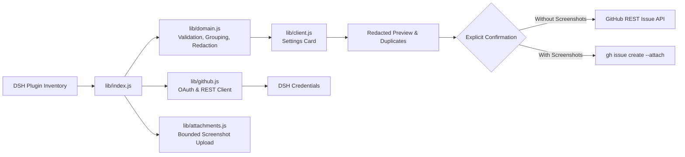

# 📦 @goodandready/dsh-issue-reporter

<div align="center">

<h3>Safe, User-Owned GitHub Bug Reports with Privacy Controls for DeepSeek Harness</h3>

<p align="center">
  <a href="https://www.npmjs.com/package/@goodandready/dsh-issue-reporter"></a>
  <a href="LICENSE"></a>
  <a href="https://github.com/topics/dsh-plugin"></a>
  <a href="https://nodejs.org"></a>
</p>

<!-- Showcase Button -->
<p align="center">
  <a href="https://goodandready.app/"></a>
</p>

<p align="center">
  <a href="README.md"><b>🇬🇧 English</b></a> •
  <a href="README.ru.md"><b>🇷🇺 Русский</b></a> •
  <a href="README.zh.md"><b>🇨🇳 中文说明</b></a>
</p>

<!-- Mandatory project support block -->
<table align="center">
  <tr>
    <td align="center">
      ⭐ <strong>If you like this plugin, please star it on GitHub</strong> — it shows me that the plugin is useful to you and motivates me to keep developing it.
      <br><br>
      🐛 <strong>If you find a bug or would like to request a feature</strong>, open a GitHub issue in any language — I will review your proposal and implement useful suggestions in a future plugin version.
    </td>
  </tr>
</table>

</div>

---

## ⚡ Overview & The Problem

When developing or running autonomous workflows in **DeepSeek Harness**, users frequently encounter issues in installed ecosystem plugins. Creating high-quality bug reports is typically a tedious, error-prone process: users have to manually locate the plugin's upstream repository, format reproduction details, and inadvertently risk leaking sensitive API keys, local paths, or internal endpoints.

**`@goodandready/dsh-issue-reporter`** bridges the gap between encountering an installed plugin failure and submitting an actionable, upstream report:
* **Active Inventory Discovery**: Automatically scans the current DSH composition and discovers installed plugins with public GitHub repositories.
* **Intelligent Grouping**: Separates native `@deepseek-ai/` core plugins from third-party community extensions in independent collapsible lists.
* **Privacy Boundary & Redaction**: Automatically sanitizes API tokens, credential references, local absolute paths, and email addresses before submission.
* **Duplicate Detection**: Queries repository issues in real time to prevent duplicate bug reports.
* **Screenshot Uploads via GitHub CLI**: Supports up to 5 image attachments without exposing persistent upload storage.
* **Strict User Ownership**: Requires explicit user preview and confirmation (`confirm: true`) before any GitHub write.

---

## 🏗️ Architecture



---

## ✨ Key Features & Capabilities

### 1. Plugin Catalog & Dual Grouping
The reporter inspects the runtime composition of DeepSeek Harness. Non-public, invalid, or duplicate packages are filtered out. Valid targets are organized into two independently collapsible groups:
* **Native DSH Plugins**: Packages scoped under `@deepseek-ai/`.
* **Third-Party Plugins**: All other community plugins and extensions.

Clicking the full plugin row opens the integrated issue composer.

### 2. GitHub OAuth Device Flow Authorization
Users authorize via GitHub's standard OAuth Device Flow with a single "Sign in with GitHub" click:
* The user is provided an 8-character verification code and redirected to GitHub's activation page.
* The plugin requests the `repo` scope to enable issue creation and duplicate search.
* The resulting access tokens are stored securely through **DSH Credentials** (`tokenEnv: GITHUB_ISSUE_REPORTER_TOKEN`).
* An explicit **Sign out** action removes credentials, allowing seamless account switching.

### 3. Report Editor & Privacy Boundary
The built-in editor captures structured report fields:
* **Title & Description**: Observed behavior, reproduction steps, expected results, and environment context.
* **Automated Sanitization**: The host automatically redacts bearer tokens, API keys, credential URLs, local system paths, and emails.
* **Live Redacted Preview**: Displays exactly what will be sent, including a detailed count of redacted items.
* **Safe Fallback**: If no GitHub account is connected, the editor provides a prefilled GitHub issue-form link for manual submission.

### 5. Autonomous Agent Reporting Tool (`report_issue`)
Registers an official tool in Cordis `ctx.tools` allowing autonomous coding agents and orchestrators to prepare or file structured bug reports whenever an installed plugin encounters an unhandled exception or runtime crash.

### 6. AI Summary & Repro Step Generator
Integrated with `ctx.llm` via `POST /dsh-issue-reporter/ai/optimize`, allowing users to polish unstructured error notes into clean, reproducible steps and an actionable issue title with one click.

### 7. Live Telemetry & Session Log Selector
Inspects recent host session logs via `GET /dsh-issue-reporter/logs`, providing a redacted log checklist to easily attach relevant server traces to the bug report.

### 8. Issue Watcher & Live Status Tracking
The "My Reports" tab persists submitted tickets and performs batch status verification (`POST /dsh-issue-reporter/issues/batch-status`), showing live open/closed status badges and comment counts.

### 9. Smart Auto-Labeling & Component Detection
Queries upstream repository labels via `POST /dsh-issue-reporter/labels` and automatically recommends matching category tags (`bug`, `ui`, `performance`, `auth`).

### 10. One-Click Settings Card Updater
In-place npm updater conforming to DSH standards: checks the registry on mount and provides an explicit "Update" button with same-origin and loopback security.

### 4. Read-Only Duplicate Search
Before submission, the plugin searches existing GitHub issues in the target repository using normalized tokens from the title and body. It ranks up to five potential duplicates to avoid noise.

### 5. Screenshot Attachments
Users can attach up to 5 screenshots (PNG, JPG, GIF, WebP; 8 MiB per file, 20 MiB total):
* Images remain in browser memory until explicit submission.
* Uploads are performed via the official GitHub CLI (`gh issue create --attach`) inside a temporary staging directory that is cleaned up in a `finally` block.
* Reports without screenshots use the standard GitHub REST API.

### 6. Runtime Modules

| Module | Responsibility |
|:### 6. Clipboard Paste (Ctrl+V) & Drag-and-Drop (v0.1.1)
Paste screenshots directly from the clipboard (`Ctrl+V` from system snipping tools) or drag-and-drop image files into an interactive dropzone with visual thumbnail cards and size indicators.

### 7. Automated System Diagnostics & Crash Prefill (v0.1.1)
Captures sanitized runtime diagnostics (Node.js, OS platform, architecture, DSH versions) without private paths or credentials. Plugins in a runtime failure state provide a one-click Quick Report with captured error stacks.

### 8. Tab Navigation & Instant Search (v0.1.1)
Styled according to the `dsh-clinebot` design system with clean tabs (Catalog, Report Editor, My Reports, Authorization) and a real-time instant search filter across all installed plugins.

### 9. Issue Lifecycle Tracking (v0.1.1)
The 'My Reports' tab maintains a local history of submitted issues, offering one-click status checks (`Open` / `Closed`) and direct links.

### 10. Multi-Forge Support (Gitea / Forgejo) (v0.1.1)
In addition to GitHub, the reporter detects repositories on local and self-hosted Gitea/Forgejo instances, supporting Gitea REST issue creation and duplicate lookups.

---|:---|
| `lib/domain.js` | Repository parsing, native/third-party classification, redaction, draft composition, duplicate ranking, and credential serialization |
| `lib/github.js` | GitHub OAuth Device Flow, refresh token exchange, authenticated user lookup, and REST issue creation |
| `lib/attachments.js` | Screenshot validation, size/count limits, temporary file lifecycle, and GitHub CLI execution |
| `lib/auth.js` | Removal of configured GitHub credentials during sign-out |
| `lib/index.js` | DSH settings registration, credentials integration, same-origin route protection, and report workflow |
| `lib/client.js` | Bilingual Web UI settings card, authorization controls, catalog, composer, preview, and feedback |

---

## 📦 Installation

Install into your DeepSeek Harness web profile:

```bash
dsh plugin --profile web add @goodandready/dsh-issue-reporter
```

Restart your DSH instance and open **Settings → Plugins → GitHub Issue Reporter**.

---

## ⚙️ GitHub OAuth App Setup

1. In GitHub Developer Settings, create an **OAuth App** (e.g., `DSH Issue Reporter`).
2. Set Homepage URL and Authorization callback URL to your DSH URL (e.g., `https://goodandready.app` or `http://127.0.0.1:3080`).
3. Under **Device Flow**, check **Enable Device Flow**.
4. Set the public Client ID in your `settings.yaml` under `appClientId`.
5. Open DSH **Settings → Plugins → GitHub Issue Reporter** and click **Sign in with GitHub**.

---

## 🔧 Configuration (`settings.yaml`)

```yaml
# settings.yaml
dsh-issue-reporter:
  # Public client ID of your GitHub OAuth App with Device Flow enabled
  appClientId: "YOUR_GITHUB_OAUTH_CLIENT_ID"
  # DSH Credentials reference holding the OAuth token (never enter raw tokens here)
  tokenEnv: "GITHUB_ISSUE_REPORTER_TOKEN"
  # GitHub REST API endpoint (default: https://api.github.com)
  apiBaseUrl: "https://api.github.com"
  # Request and CLI attachment timeout in milliseconds
  timeoutMs: 30000
  # Executable name or absolute path for GitHub CLI
  ghPath: "gh"
```

### Parameters Reference

| Parameter | Type | Default | Description |
|:---|:---|:---|:---|
| `appClientId` | `string` | `""` | Public GitHub OAuth App Client ID with Device Flow enabled |
| `tokenEnv` | `string` | `"GITHUB_ISSUE_REPORTER_TOKEN"` | DSH Credentials reference storing user OAuth material |
| `apiBaseUrl` | `string` | `"https://api.github.com"` | GitHub REST API endpoint |
| `timeoutMs` | `number` | `30000` | Timeout in milliseconds for API requests and CLI attachment uploads |
| `ghPath` | `string` | `"gh"` | Path to the `gh` binary on the host (used for screenshot reports) |

---

## 🔌 HTTP API Routes

All routes enforce DSH browser session authentication and same-origin protections.

| Method & Route | Purpose | External Write |
|:---|:---|:---|
| `GET /dsh-issue-reporter/status` | Return sanitized configuration status and discovered plugin catalog | No |
| `POST /dsh-issue-reporter/device/start` | Initiate OAuth Device Flow and return user verification code | No |
| `POST /dsh-issue-reporter/device/poll` | Poll authorization status, validate identity, and persist credentials | DSH Credentials |
| `POST /dsh-issue-reporter/device/logout` | Revoke/delete stored credentials during sign-out | DSH Credentials |
| `POST /dsh-issue-reporter/draft` | Compose a sanitized draft with redaction summary | No |
| `POST /dsh-issue-reporter/duplicates` | Search and rank likely duplicate issues | Read-only GitHub |
| `POST /dsh-issue-reporter/create` | Submit confirmed issue via REST API or `gh --attach` | GitHub Issue |

---

## 🛠️ Limits and Troubleshooting

| Symptom | Cause & Solution |
|:---|:---|
| `GitHub sign-in is not configured` | Add the public `appClientId` to `settings.yaml` under `dsh-issue-reporter`. |
| `404 Not Found` during sign-in | Device code requests must target `github.com/login/device/code`, not `api.github.com`. |
| `Resource not accessible by integration` | The authorized identity lacks write access, or an old token is cached. Sign out and sign in again. |
| Screenshot attachment failure | Ensure `gh` CLI 2.99+ is installed on the host and accessible via `ghPath`. |
| `GitHub authorization is invalid or expired` | Refresh token expired. Click Sign Out and re-authorize. |
| Plugin has no report action | The plugin manifest does not provide a valid public GitHub repository URL. |

---

## 🔒 Security Notes

* **Credential Protection**: OAuth tokens are resolved exclusively from DSH Credentials and are never displayed in UI, logs, URLs, or issue bodies.
* **Data Sanitization**: Automatic masking of bearer tokens, passwords, private keys, local paths, and email addresses.
* **Temporary Storage**: Uploaded screenshots are stored only in temporary directories that are wiped immediately after the `gh` process exits.
* **Explicit User Consent**: Issues are never submitted without the user checking the confirmation checkbox.

---

## 📄 License

MIT © [GooDAnDReaDY](https://github.com/GooDAnDReaDY)
