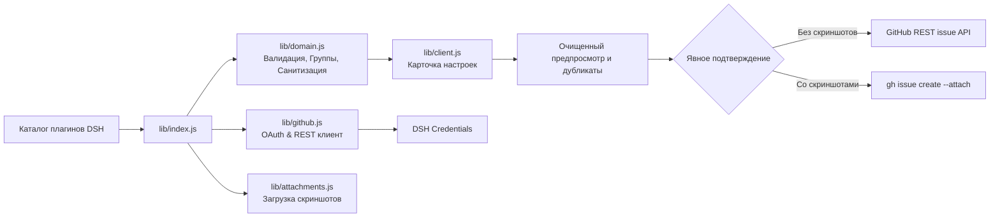

# 📦 @goodandready/dsh-issue-reporter

<div align="center">

<h3>Безопасная отправка проверенных отчётов об ошибках плагинов в GitHub для DeepSeek Harness</h3>

<p align="center">
  <a href="https://www.npmjs.com/package/@goodandready/dsh-issue-reporter"></a>
  <a href="LICENSE"></a>
  <a href="https://github.com/topics/dsh-plugin"></a>
  <a href="https://nodejs.org"></a>
</p>

<!-- Обязательная кнопка перехода на витрину всех проектов -->
<p align="center">
  <a href="https://goodandready.app/"></a>
</p>

<p align="center">
  <a href="README.md"><b>🇬🇧 English</b></a> •
  <a href="README.ru.md"><b>🇷🇺 Русский</b></a> •
  <a href="README.zh.md"><b>🇨🇳 中文说明</b></a>
</p>

<!-- Обязательный блок поддержки проекта -->
<table align="center">
  <tr>
    <td align="center">
      ⭐ <strong>Если вам нравится этот плагин, поставьте ему звезду на GitHub</strong> — это покажет мне, что плагин вам полезен, и будет мотивировать меня развивать его дальше.
      <br><br>
      🐛 <strong>Если вы нашли баг или хотите предложить новый функционал</strong>, создайте issue на GitHub на любом языке — я рассмотрю ваше предложение и реализую полезные идеи в одной из следующих версий плагина.
    </td>
  </tr>
</table>

</div>

---

## ⚡ Обзор и решаемая проблема

При разработке или выполнении автономных задач в **DeepSeek Harness** пользователи регулярно сталкиваются со сбоями установленных плагинов экосистемы. Составление полезного баг-репорта вручную отнимает много времени: нужно найти публичный репозиторий плагина, структурировать шаги воспроизведения и случайно не слить в открытый доступ токены, пароли или локальные файловые пути.

**`@goodandready/dsh-issue-reporter`** автоматизирует подготовку качественных upstream-отчётов об ошибках:
* **Авто-сканирование плагинов**: считывает текущую композицию DSH и находит установленные плагины с публичными репозиториями на GitHub.
* **Умная группировка**: разделяет нативные плагины ядра `@deepseek-ai/` и сторонние плагины сообщества в два независимых списка.
* **Защита приватности и санитизация**: автоматически вырезает и маскирует API-токены, ссылки на учётные записи, абсолютные пути и email-адреса.
* **Поиск дубликатов**: проверяет открытые issue в целевом репозитории для предотвращения повторов.
* **Прикрепление скриншотов**: поддерживает загрузку до 5 изображений через официальный CLI GitHub (`gh issue create --attach`) с изоляцией во временных каталогах.
* **Контроль пользователя**: требует явного подтверждения (`confirm: true`) и предпросмотра очищенного текста перед созданием issue.

---

## 🏗️ Архитектура



---

## ✨ Ключевые возможности

### 1. Каталог и раздельная группировка
Плагин сканирует установленные пакеты DSH. Пакеты без публичного GitHub-репозитория или с некорректными метаданными отфильтровываются. Поддерживаемые цели распределяются по двум блокам:
* **Нативные плагины DSH**: пакеты со скоупом `@deepseek-ai/`.
* **Сторонние плагины**: все остальные дополнения экосистемы.

Нажатие на строку любого плагина открывает форму составления отчёта.

### 2. Авторизация через GitHub OAuth Device Flow
Подключение аккаунта происходит в 1 клик через стандартный механизм Device Flow:
* Пользователь получает короткий 8-значный код и переходит на страницу активации GitHub.
* Запрашивается скоуп `repo` для создания issue и поиска дубликатов.
* Полученный OAuth-токен сохраняется в безопасном хранилище **DSH Credentials** (`tokenEnv: GITHUB_ISSUE_REPORTER_TOKEN`).
* Кнопка **Sign out** моментально отзывает токен и позволяет сменить учётную запись.

### 3. Редактор отчётов и контроль приватности
Форма принимает структурированные данные: заголовок, наблюдаемое и ожидаемое поведение, шаги воспроизведения и окружение. Бэкенд автоматически очищает черновик от конфиденциальных данных (токены, пароли, пути вида `/home/...`, email) и выводит список замаскированных фрагментов перед отправкой.

Если аккаунт не подключён, плагин генерирует готовую веб-ссылку с предзаполненной формой issue для ручной отправки в браузере.

### 4. Поиск дубликатов
Перед отправкой плагин выполняет поиск по открытым issue в целевом репозитории по ключевым словам и ранжирует до 5 наиболее похожих тикетов, защищая репозиторий от дубликатов.

### 5. Скриншоты через GitHub CLI
Поддерживается прикрепление до 5 изображений (PNG, JPG, GIF, WebP; до 8 МБ на файл, до 20 МБ суммарно):
* Файлы удерживаются в памяти браузера до нажатия кнопки создания.
* Загрузка на GitHub выполняется через официальный CLI `gh issue create --attach` во временном каталоге, который гарантированно удаляется после завершения.
* Обычные текстовые отчёты создаются напрямую через GitHub REST API.

### 6. Вставка из буфера обмена (Ctrl+V) и Drag-and-Drop (v0.1.1)
Поддерживается быстрая вставка скриншотов прямо из буфера обмена (`Ctrl+V` при снятии скриншота ножницами или `PrtSc`) и перетаскивание изображений в интерактивную область Dropzone с мгновенным показом миниатюр.

### 7. Автоматическая диагностика окружения и сбоев (v0.1.1)
Плагин автоматически собирает безопасную информацию об окружении (версия Node.js, ОС, архитектура, версия DSH и плагина) и маскирует локальные пути. Для упавших плагинов (`failed`) доступна кнопка быстрого репорта с захваченным текстом ошибки.

### 8. Навигация по вкладкам и быстрый поиск (v0.1.1)
Интерфейс оформлен в едином дизайн-коде `dsh-clinebot` с вкладками: «Каталог плагинов», «Редактор отчёта», «Мои отчёты» и «Авторизация». Над каталогом доступно поле живого поиска для мгновенной фильтрации.

### 9. Отслеживание отправленных тикетов (v0.1.1)
Вкладка «Мои отчёты» сохраняет историю отправленных тикетов и позволяет в один клик обновлять их текущий статус (`Open` / `Closed`) и количество комментариев.

### 10. Поддержка Gitea и Forgejo (v0.1.1)
Помимо публичного GitHub, плагин распознаёт репозитории локальных и self-hosted инстансов Gitea / Forgejo и умеет создавать issue через Gitea REST API.

---

## 📦 Установка

Установка в профиль `web` DeepSeek Harness:

```bash
dsh plugin --profile web add @goodandready/dsh-issue-reporter
```

Перезапустите экземпляр DSH и откройте **Настройки → Плагины → GitHub Issue Reporter**.

---

## ⚙️ Настройка GitHub OAuth App

1. В настройках GitHub (Developer settings → OAuth Apps) создайте приложение.
2. Включите галочку **Enable Device Flow**.
3. Укажите публичный Client ID в `settings.yaml` плагина в параметре `appClientId`.
4. В веб-интерфейсе DSH нажмите **Sign in with GitHub**, перейдите по ссылке и введите код.

---

## 🔧 Конфигурация (`settings.yaml`)

```yaml
# settings.yaml
dsh-issue-reporter:
  # Публичный Client ID созданного GitHub OAuth App
  appClientId: "ВАШ_GITHUB_OAUTH_CLIENT_ID"
  # Ссылка на DSH Credentials для хранения токена
  tokenEnv: "GITHUB_ISSUE_REPORTER_TOKEN"
  # Базовый адрес API GitHub
  apiBaseUrl: "https://api.github.com"
  # Таймаут сетевых запросов и загрузки скриншотов (мс)
  timeoutMs: 30000
  # Путь к бинарнику GitHub CLI
  ghPath: "gh"
```

| Параметр | Тип | По умолчанию | Описание |
|:---|:---|:---|:---|
| `appClientId` | `string` | `""` | Публичный Client ID OAuth-приложения с включённым Device Flow |
| `tokenEnv` | `string` | `"GITHUB_ISSUE_REPORTER_TOKEN"` | Имя ссылки в DSH Credentials для хранения OAuth-токена |
| `apiBaseUrl` | `string` | `"https://api.github.com"` | Базовый URL API GitHub |
| `timeoutMs` | `number` | `30000` | Таймаут HTTP-запросов и выполнения CLI в миллисекундах |
| `ghPath` | `string` | `"gh"` | Имя или абсолютный путь к исполняемому файлу `gh` на хосте |

---

## 🔌 HTTP-маршруты

Все маршруты защищены сессионной авторизацией DSH и проверкой Same-Origin.

| Метод и путь | Назначение | Внешняя запись |
|:---|:---|:---|
| `GET /dsh-issue-reporter/status` | Получение статуса конфигурации и каталога плагинов | Нет |
| `POST /dsh-issue-reporter/device/start` | Инициализация Device Flow и получение кода устройства | Нет |
| `POST /dsh-issue-reporter/device/poll` | Опрос статуса авторизации и сохранение токена | DSH Credentials |
| `POST /dsh-issue-reporter/device/logout` | Удаление сохранённого токена при выходе | DSH Credentials |
| `POST /dsh-issue-reporter/draft` | Генерация очищенного от конфиденциальных данных черновика | Нет |
| `POST /dsh-issue-reporter/duplicates` | Поиск и ранжирование похожих issue | Read-only GitHub |
| `POST /dsh-issue-reporter/create` | Создание подтверждённого issue через REST API или `gh` | GitHub Issue |

---

## 🛠️ Ограничения и диагностика

| Симптом | Причина и решение |
|:---|:---|
| `GitHub sign-in is not configured` | Укажите публичный `appClientId` в `settings.yaml`. |
| `404 Not Found` при входе | Запрос кода устройства должен отправляться на `github.com`, а не на `api.github.com`. |
| `Resource not accessible by integration` | У подключённого аккаунта нет прав на запись в репозиторий, либо устарел токен. Выполните Sign Out и войдите снова. |
| Ошибка загрузки скриншотов | Убедитесь, что на сервере установлен GitHub CLI (`gh` версии 2.99 или выше). |
| Кнопка отправки недоступна для плагина | В `package.json` плагина не указана валидная ссылка на публичный GitHub-репозиторий. |

---

## 🔒 Безопасность

* **Безопасное хранилище**: токены живут исключительно в сервисе DSH Credentials и никогда не передаются в тело issue, URL или логи.
* **Авто-санитизация**: маскирование приватных токенов, ключей, паролей, локальных путей и email-адресов.
* **Изоляция вложений**: временные файлы скриншотов удаляются сразу же после завершения команды `gh`.
* **Явное согласие**: ни один отчёт не создаётся без предварительного просмотра и явной установки флага `confirm: true`.

---

## 📄 Лицензия

MIT © [GooDAnDReaDY](https://github.com/GooDAnDReaDY)
