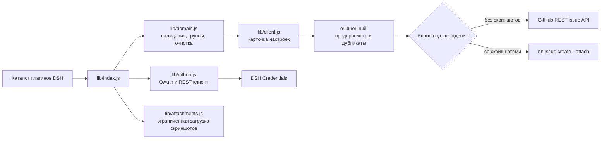

# dsh-issue-reporter

Плагин DeepSeek Harness для подготовки проверяемых GitHub issue по найденным проблемам плагинов с контролем приватности.

Карточка настроек читает текущий состав DSH и показывает два независимо раскрываемых списка:

- Нативные плагины DSH с package scope @deepseek-ai/.
- Сторонние плагины с любым другим package scope.

Пользователь выбирает совместимый плагин, заполняет отчёт, проверяет очищенный предпросмотр и возможные дубликаты, а затем явно подтверждает создание issue. Авторизация GitHub запускается одной кнопкой "Sign in with GitHub". Client id OAuth App Device Flow, ссылка на credential и URL API являются конфигурацией установки и больше не показываются как поля для ручного ввода.

Когда аккаунт GitHub подключён, в разделе авторизации появляется кнопка «Sign out». Она удаляет сохранённые OAuth-данные из DSH Credentials, после чего можно войти под другим аккаунтом.

Если GitHub OAuth App client id не настроен, плагин честно сообщает, что вход недоступен. Если аккаунт ещё не авторизован, остаётся ссылка на предварительно заполненную форму issue.

Карточка использует нативное поведение настроек DSH: для раскрытия или сворачивания нужно нажать на всю строку заголовка карточки, а для открытия отчёта — на всю строку поддерживаемого плагина. Отдельные кнопки справа для этих действий не используются.

В настройках GitHub OAuth App должен быть включён Device Flow. Временный код устройства и OAuth-токен с правом repo запрашиваются через github.com; параметры Device Flow передаются в query-параметрах, как требует API GitHub; а api.github.com используется только для авторизованных GitHub API-запросов. Ошибка 404 Not Found при входе означает, что запущена старая сборка, отправляющая OAuth-запрос на REST API-домен.

## Документация

- [Design contract](docs/design/DESIGN.md)
- [План Issue #1](docs/plans/issue-1-github-issue-reporter.md)
- [План Issue #3: UX, авторизация и группы](docs/plans/issue-3-ux-auth-plugin-groups.md)
- [English documentation](README.md)
- [中文文档](README.zh.md)

## Разработка

Запустить детерминированные тесты:

    npm test

Регистрация GitHub OAuth App, публикация и production-деплой выполняются только после отдельного подтверждения владельца.

## Обзор

Плагин закрывает разрыв между обнаружением ошибки DSH-плагина и созданием действительно полезного upstream-репорта. Он читает установленную композицию, получает метаданные публичных GitHub-репозиториев, готовит структурированный отчёт, удаляет типовые секреты и приватные пути, ищет вероятные дубликаты и ждёт явного подтверждения пользователя перед любой записью в GitHub.

Это плагин настроек DSH: `lib/client.js` отвечает за браузерный интерфейс, а `lib/index.js` — за защищённые HTTP-маршруты и интеграцию с сервисами DSH. Плагин не изменяет, не включает, не отключает и не обновляет установленные плагины.

## Архитектура



## Возможности

### Каталог и группировка плагинов

Каталог строится по моментальному снимку текущей композиции DSH. Дубликаты удаляются, package metadata проверяется, а целями репортов становятся только валидные публичные GitHub-репозитории. Пакеты с именем, начинающимся с `@deepseek-ai/`, попадают в список **Native DSH plugins**; остальные корректные пакеты — в **Third-party plugins**. Списки раскрываются и сворачиваются независимо.

В строке поддерживаемого плагина показываются имя пакета, репозиторий и одно действие репорта. Клик по всей строке заголовка карточки раскрывает или сворачивает репортер; клик по всей строке плагина открывает редактор. Дублирующая кнопка справа не рендерится.

### Авторизация GitHub

Каждый пользователь DSH авторизует свой аккаунт через GitHub OAuth App Device Flow. Запрашивается scope `repo`, потому что создание issue и поиск дубликатов требуют доступа к репозиторию. Публичный client id OAuth App — это конфигурация установки, а не секрет; в форму репорта он не попадает. Access/refresh material хранится только через DSH Credentials. Кнопка **Sign out** удаляет сохранённые данные и позволяет войти под другим аккаунтом.

Запросы Device Flow идут на `github.com`, а авторизованные запросы пользователя и репозиториев — на настроенный GitHub API URL. В регистрации OAuth App должен быть включён Device Flow.

### Редактор и граница приватности

Редактор принимает заголовок, наблюдаемое поведение, шаги воспроизведения, ожидаемое поведение, сведения об окружении и необязательный контекст DSH/плагина. Сервер ограничивает размеры полей и очищает токены, credential assignments, URL с credentials, локальные пути и email-адреса, после чего возвращает безопасный черновик и сводку очистки. До создания пользователь видит репозиторий, предпросмотр и возможные дубликаты и устанавливает подтверждение.

Если аккаунт не подключён, остаётся безопасная fallback-ссылка на предварительно заполненную GitHub issue form. Если репозиторий не публичный или не прошёл проверку, он не предлагается для репорта.

### Поиск дубликатов

Поиск дубликатов не изменяет данные. Плагин запрашивает issues выбранного репозитория и ранжирует кандидатов по пересечению нормализованных слов из безопасных заголовка и тела. Возвращается не более пяти кандидатов; токен не помещается в URL или текст issue.

### Скриншоты

Можно выбрать до пяти PNG, JPG, GIF или WebP. Максимум для одного файла — 8 MiB, общий размер — 20 MiB. Имена файлов очищаются, расширение и MIME должны совпадать, пустые файлы и некорректный base64 отклоняются.

До подтверждения скриншоты находятся только в памяти браузера. После подтверждения сервер записывает очищенное тело issue и ограниченные файлы во временный каталог, запускает `gh issue create --attach`, а затем удаляет каталог в `finally`. Для этого нужен GitHub CLI 2.99 или новее. GitHub App user-to-server token не поддерживается этим attachment flow, поэтому для репортов со скриншотами нужен OAuth App token или PAT. Репорты без вложений по-прежнему создаются через GitHub REST API.

### Модули

| Модуль | Ответственность |
| --- | --- |
| `lib/domain.js` | Разбор репозитория, классификация native/third-party, каталог, очистка, черновики, дубликаты, состояние Device Flow и сериализация credentials. |
| `lib/github.js` | GitHub OAuth Device Flow, обмен refresh token, текущий пользователь, поиск и REST-создание issue. |
| `lib/attachments.js` | Проверка скриншотов, лимиты, временные файлы, вызов GitHub CLI и совместимость токенов. |
| `lib/auth.js` | Удаление настроенного GitHub credential при выходе. |
| `lib/index.js` | Регистрация настроек DSH, Credentials, обогащение каталога, same-origin защита и workflow репорта. |
| `lib/client.js` | Английская/китайская карточка настроек, авторизация, группы, редактор, предпросмотр, дубликаты, вложения и состояния. |

## Установка

```bash
dsh plugin --profile web add @goodandready/dsh-issue-reporter
```

Если профиль не перезагрузил bundle автоматически, перезапустите DSH web profile и откройте **Settings → Plugins → GitHub issue reporter**.

## Настройка GitHub OAuth App

1. Создайте или выберите GitHub OAuth App.
2. Включите **Device Flow** в настройках приложения.
3. Укажите публичный client id в конфигурации установки плагина.
4. Откройте карточку и нажмите **Sign in with GitHub**.
5. Откройте страницу проверки устройства GitHub, введите показанный код и разрешите доступ нужному аккаунту.
6. Убедитесь, что карточка показывает **GitHub connected**. Перед сменой аккаунта нажмите **Sign out**.

Client secret плагину не нужен. У пользователя должны быть права на создание issues в выбранном репозитории; OAuth не обходит права репозитория.

## Конфигурация

```yaml
dsh-issue-reporter:
  appClientId: <GITHUB_OAUTH_APP_CLIENT_ID>
  tokenEnv: GITHUB_ISSUE_REPORTER_TOKEN
  apiBaseUrl: https://api.github.com
  timeoutMs: 30000
  ghPath: gh
```

| Параметр | Тип | По умолчанию | Описание |
| --- | --- | --- | --- |
| `appClientId` | string | пусто | Публичный client id GitHub OAuth App с включённым Device Flow. |
| `tokenEnv` | credential reference | `GITHUB_ISSUE_REPORTER_TOKEN` | Ссылка на DSH Credentials с OAuth-данными пользователя. |
| `apiBaseUrl` | URL string | `https://api.github.com` | Базовый URL REST API GitHub или совместимого GitHub Enterprise. |
| `timeoutMs` | number | `30000` | Таймаут запросов GitHub и CLI вложений. |
| `ghPath` | string | `gh` | Путь к GitHub CLI, используемому только для репортов со скриншотами. |

## HTTP-маршруты

Все маршруты требуют DSH browser auth и проверок same-origin/trusted request; ответы JSON помечаются `no-store`.

| Метод и маршрут | Назначение | Внешняя запись |
| --- | --- | --- |
| `GET /dsh-issue-reporter/status` | Возвращает очищенное состояние конфигурации и каталог плагинов. | Нет |
| `POST /dsh-issue-reporter/device/start` | Запускает OAuth Device Flow и возвращает короткоживущий flow id и код. | Нет |
| `POST /dsh-issue-reporter/device/poll` | Проверяет авторизацию, текущего пользователя и сохраняет credential. | Только Credentials |
| `POST /dsh-issue-reporter/device/logout` | Удаляет GitHub credential и состояния flow. | Только Credentials |
| `POST /dsh-issue-reporter/draft` | Собирает очищенный черновик и fallback URL. | Нет |
| `POST /dsh-issue-reporter/duplicates` | Ищет и сортирует вероятные дубликаты. | Только чтение GitHub |
| `POST /dsh-issue-reporter/create` | Создаёт подтверждённый issue через REST или `gh --attach`. | GitHub issue |

Маршрут создания отклоняет запрос без `confirm: true`, валидного публичного репозитория или безопасного черновика. Без аккаунта он возвращает prefilled issue form и не пытается писать молча.

## Ограничения и диагностика

| Симптом | Значение и действие |
| --- | --- |
| `GitHub sign-in is not configured` | Укажите client id OAuth App в конфигурации установки. |
| `404 Not Found` при входе | Работает старая сборка, отправляющая OAuth-запросы на REST API host; обновите плагин. |
| `Resource not accessible by integration` | У аккаунта нет доступа к выбранному репозиторию либо сохранился старый GitHub App token; выйдите и авторизуйтесь через OAuth App. |
| Ошибка совместимости токена для скриншота | Используйте OAuth App token или PAT и GitHub CLI 2.99+. |
| Нет действия репорта у плагина | У пакета нет проверяемых публичных GitHub metadata. |

## Безопасность

- Токены читаются только из DSH Credentials и не отображаются в UI, snapshots, URL, логах или issue body.
- Metadata плагинов, поля репорта, имена файлов, MIME и base64 проверяются и ограничиваются до использования.
- Скриншоты не сохраняются в DSH storage; временные файлы удаляются после завершения CLI.
- Плагин не изменяет установленные плагины и не отправляет репорт без явного подтверждения.

## Статус релиза

Версия `0.1.0` подготовлена как одобренный владельцем release candidate для публичной публикации в GitHub и npm.

## Лицензия

MIT © [GooDAnDReaDY](https://github.com/GooDAnDReaDY)
