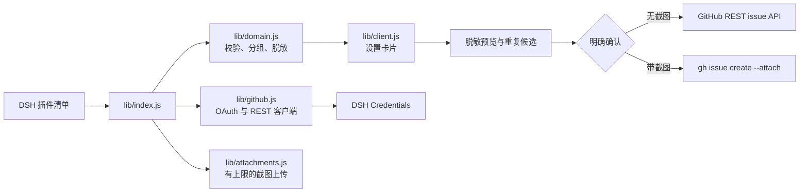

# 📦 @goodandready/dsh-issue-reporter

<div align="center">

<h3>面向 DeepSeek Harness 的安全 GitHub 插件 Bug 报告与隐私脱敏工具</h3>

<p align="center">
  <a href="https://www.npmjs.com/package/@goodandready/dsh-issue-reporter"></a>
  <a href="LICENSE"></a>
  <a href="https://github.com/topics/dsh-plugin"></a>
  <a href="https://nodejs.org"></a>
</p>

<!-- 作者全部项目 -->
<p align="center">
  <a href="https://goodandready.app/"></a>
</p>

<p align="center">
  <a href="README.md"><b>🇬🇧 English</b></a> •
  <a href="README.ru.md"><b>🇷🇺 Русский</b></a> •
  <a href="README.zh.md"><b>🇨🇳 中文说明</b></a>
</p>

<!-- 强制性项目支持模块 -->
<table align="center">
  <tr>
    <td align="center">
      ⭐ <strong>如果您喜欢这个插件，请在 GitHub 上为它点亮 Star</strong> — 这能让我知道插件对您有用，并鼓励我继续开发和维护它。
      <br><br>
      🐛 <strong>如果您发现 Bug 或希望增加功能</strong>，请使用任意语言在 GitHub 上提交 Issue — 我会评估您的建议，并在后续版本中实现有价值的改进。
    </td>
  </tr>
</table>

</div>

---

## ⚡ 概览与核心定位

在 **DeepSeek Harness** 中进行自动化任务或开发时，用户经常会遇到已安装插件的异常。传统情况下提交 Bug 报告既繁琐又容易泄露机密：用户需要手动查找目标仓库，组织复现步骤，并极易无意泄露 API Key、内网地址或本地隐私路径。

**`@goodandready/dsh-issue-reporter`** 实现了从发现插件故障到向上游提交高质量规范报告的自动化闭环：
* **运行时插件探测**：自动读取当前 DSH 组合，提取具备公开 GitHub 仓库的插件。
* **双列表智能分组**：将原生 `@deepseek-ai/` 核心插件与第三方生态插件归类为两个独立折叠面板。
* **隐私脱敏与安全边界**：自动过滤并脱敏 API Token、凭据参数、绝对文件路径与邮件地址。
* **重复 Issue 实时检索**：自动检索目标仓库现有 Issue，防止重复提单。
* **截图附件安全上传**：通过官方 GitHub CLI (`gh issue create --attach`) 支持最多 5 张截图上传，并在完成后自动清理临时目录。
* **严格的用户确认控制**：在执行任何 GitHub 写入操作前，均需用户亲自预览脱敏内容并勾选确认 (`confirm: true`)。

---

## 🏗️ 架构设计



---

## ✨ 核心功能

### 1. 插件目录与独立分组
插件在加载时自动检查当前 DSH 运行环境中的所有插件。自动过滤无公开 GitHub 仓库的内部包，将可用目标整理为两组：
* **原生 DSH 插件**：包名以 `@deepseek-ai/` 开头的核心组件。
* **第三方生态插件**：所有其他由社区或第三方开发的扩展。

点击任意支持插件的整行即可快速展开报告编辑器。

### 2. GitHub OAuth Device Flow 授权
采用 GitHub 官方标准设备码流（Device Flow），支持一键授权：
* 点击“使用 GitHub 登录”，系统提供 8 位验证码并引导用户在 GitHub 验证页面批准。
* 申请 `repo` 权限以支持创建 Issue 及读取现有 Issue 进行重复比对。
* OAuth Token 安全托管于 **DSH Credentials**（`tokenEnv: GITHUB_ISSUE_REPORTER_TOKEN`），绝不硬编码。
* 提供“退出登录”按钮，一键从凭据中心吊销并支持切换其他账号。

### 3. 报告编辑器与隐私边界
表单规范化采集问题标题、实际表现、复现步骤、期望结果及环境说明。后端在生成草稿时自动对敏感信息（API Token、密码、私有路径如 `/home/...`、邮箱）进行脱敏遮蔽，并在界面列出脱敏项摘要。

未登录状态下，支持一键生成带预填参数的 GitHub Issue 网页链接供用户手动提交。

### 5. 自主 Agent 报告工具 (`report_issue`)
在 Cordis `ctx.tools` 中注册官方工具，允许自主编程 Agent 与任务编排器在插件发生异常时自动提炼并起草规范的 Issue。

### 6. AI 润色与复现步骤生成器
通过 `POST /dsh-issue-reporter/ai/optimize` 与 `ctx.llm` 联动，一键将零散的报错描述转化为清晰专业的复现步骤与精准标题。

### 7. 实时会话日志与片段选择器
通过 `GET /dsh-issue-reporter/logs` 检索最近的宿主会话日志，经过自动脱敏后支持勾选插入到诊断报告中。

### 8. Issue 追踪器与状态同步
“我的报告”标签页记录提交记录并支持批量刷新 (`POST /dsh-issue-reporter/issues/batch-status`)，实时展示 open/closed 状态与评论数。

### 9. 智能标签推荐与组件识别
通过 `POST /dsh-issue-reporter/labels` 查询远端仓库可用标签，并智能推荐匹配分类 (`bug`, `ui`, `performance`, `auth`)。

### 10. 设置卡片一键更新
遵循 DSH 规范的原生 npm 更新机制：自动检查版本并在设置卡片中提供一键更新按钮，支持同一来源及回环地址安全保护。

### 4. 重复 Issue 智能检索
在提交前，插件根据标题和正文关键词向目标仓库发起只读检索，按相关度推荐前 5 个最相似的候选 Issue，避免重复提单干扰开源项目维护者。

### 5. 截图附件安全上传
支持上传最多 5 张图片（PNG、JPG、GIF、WebP；单张上限 8 MiB，总计上限 20 MiB）：
* 截图在用户点击确认前仅保存在浏览器内存中。
* 确认后通过 DSH 主机上的官方 `gh issue create --attach` 在临时隔离目录完成上传，命令退出时在 `finally` 块中立即销毁临时文件。
* 纯文本报告则直接通过 GitHub REST API 快速创建。

### 6. 剪贴板粘贴 (Ctrl+V) 与拖放支持 (v0.1.1)
支持直接从系统剪贴板粘贴截图（使用截图工具后按 `Ctrl+V`），或将图片拖放到交互式拖放区中，带有缩略图卡片与大小提示。

### 7. 自动化环境诊断与故障快速反馈 (v0.1.1)
自动收集已脱敏的运行时环境信息（Node.js、操作系统、架构与版本）。发生运行时崩溃的插件提供一键快速反馈功能并预填捕获的堆栈。

### 8. 标签页导航与即时搜索 (v0.1.1)
采用 `dsh-clinebot` 统一设计系统，提供清晰的标签页（插件目录、问题编辑器、已提交报告、授权设置）以及针对已安装插件的实时搜索过滤功能。

### 9. Issue 生命周期跟踪 (v0.1.1)
“我的报告”标签页保留已提交 issue 的本地记录，并支持一键刷新当前状态（`开启` / `已关闭`）。

### 10. 多代码平台支持 (Gitea / Forgejo) (v0.1.1)
除 GitHub 外，插件还能识别本地与自建的 Gitea/Forgejo 仓库，并支持通过 Gitea REST API 创建 issue 和搜索重复项。

---

## 📦 安装指南

安装至 DeepSeek Harness Web 配置文件：

```bash
dsh plugin --profile web add @goodandready/dsh-issue-reporter
```

重启 DSH 实例，在左侧导航进入 **设置 → 插件设置 → GitHub Issue Reporter**。

---

## ⚙️ GitHub OAuth App 配置

1. 在 GitHub 个人设置进入 Developer settings → OAuth Apps 创建新应用。
2. 勾选 **Enable Device Flow** 选项。
3. 将生成的 Client ID 填入 DSH 的 `settings.yaml` 配置项 `appClientId` 中。
4. 打开 DSH 设置卡片，点击 **Sign in with GitHub**，完成设备绑定。

---

## 🔧 配置项 (`settings.yaml`)

```yaml
# settings.yaml
dsh-issue-reporter:
  # 启用了 Device Flow 的 GitHub OAuth App 公开 Client ID
  appClientId: "YOUR_GITHUB_OAUTH_CLIENT_ID"
  # 存放 OAuth 令牌的 DSH Credentials 引用名称
  tokenEnv: "GITHUB_ISSUE_REPORTER_TOKEN"
  # GitHub REST API 地址 (默认 https://api.github.com)
  apiBaseUrl: "https://api.github.com"
  # 网络请求与 CLI 附件上传超时时间 (毫秒)
  timeoutMs: 30000
  # 主机上的 gh 命令行可执行文件路径
  ghPath: "gh"
```

| 参数 | 类型 | 默认值 | 说明 |
|:---|:---|:---|:---|
| `appClientId` | `string` | `""` | 启用了 Device Flow 的公开 GitHub OAuth App Client ID |
| `tokenEnv` | `string` | `"GITHUB_ISSUE_REPORTER_TOKEN"` | 保存 OAuth 凭据的 DSH Credentials 引用名 |
| `apiBaseUrl` | `string` | `"https://api.github.com"` | GitHub REST API 基础端点 |
| `timeoutMs` | `number` | `30000` | HTTP 请求与 CLI 执行的超时时间（毫秒） |
| `ghPath` | `string` | `"gh"` | 主机上的 GitHub CLI (`gh`) 路径 |

---

## 🔌 HTTP API 路由

所有接口均受 DSH 身份校验及同源安全策略保护。

| 请求方法与路由 | 用途 | 外部写操作 |
|:---|:---|:---|
| `GET /dsh-issue-reporter/status` | 获取配置状态与已检测到的插件目录 | 否 |
| `POST /dsh-issue-reporter/device/start` | 发起 Device Flow 并获取用户验证码 | 否 |
| `POST /dsh-issue-reporter/device/poll` | 轮询授权结果并持久化凭据 | DSH Credentials |
| `POST /dsh-issue-reporter/device/logout` | 退出登录并删除存储的凭据 | DSH Credentials |
| `POST /dsh-issue-reporter/draft` | 生成脱敏后的报告草稿及脱敏摘要 | 否 |
| `POST /dsh-issue-reporter/duplicates` | 搜索目标仓库潜在的重复 Issue | 否 (只读 GitHub) |
| `POST /dsh-issue-reporter/create` | 提交已确认的 Issue (通过 REST 或 `gh`) | GitHub Issue 写入 |

---

## 🛠️ 限制与排错

| 异常现象 | 原因与解决方案 |
|:---|:---|
| `GitHub sign-in is not configured` | 请在 `settings.yaml` 中配置 `appClientId`。 |
| 登录时提示 `404 Not Found` | 请求设备码需指向 `github.com`，而非 `api.github.com`。 |
| `Resource not accessible by integration` | 当前授权账号没有该仓库的写权限，或缓存了旧 Token。请点击 Sign out 并重新登录。 |
| 截图附件上传失败 | 确保 DSH 运行主机已安装 GitHub CLI (`gh` 2.99 或更高版本)。 |
| 某个已安装插件没有报错操作 | 该插件的 package.json 中未配置有效的公开 GitHub 仓库地址。 |

---

## 🔒 安全规范

* **凭据隔离**：OAuth Token 仅存于 DSH Credentials，绝不在 UI、URL、日志或 Issue 正文中明文暴露。
* **数据脱敏**：自动过滤鉴权令牌、密码、内网地址、私有文件路径及邮箱。
* **临时文件生命周期**：截图文件仅在临时目录暂存，`gh` 命令执行结束后立即物理删除。
* **明确确认保护**：所有提交操作均需用户显式勾选确认，杜绝未经授权的隐式提交。

---

## 📄 许可证

MIT © [GooDAnDReaDY](https://github.com/GooDAnDReaDY)
