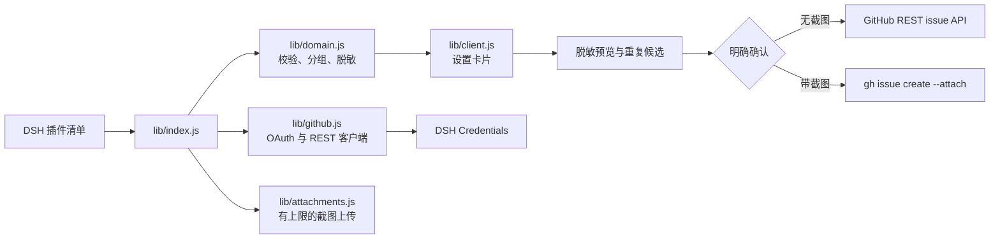

# dsh-issue-reporter

这是一个 DeepSeek Harness 插件，用于将已发现的插件问题整理成安全、可审核的 GitHub issue。

设置卡片会读取当前 DSH 组合，并提供两个可以分别展开或折叠的列表：

- 原生 DSH 插件：package scope 为 @deepseek-ai/。
- 第三方插件：其他 package scope 的插件。

用户选择受支持的插件，填写报告，检查已隐藏敏感信息的预览和可能的重复 issue，然后明确确认后才会创建 issue。GitHub 授权从一个“使用 GitHub 登录”操作开始。OAuth App Device Flow client id、凭据引用和 API 地址属于安装配置，不再作为普通用户需要填写的字段。

连接 GitHub 账号后，授权区域还会显示“退出登录”。退出登录会从 DSH Credentials 中删除已保存的 OAuth 信息；之后可以使用另一个账号重新登录。

报告编辑器可以选择最多五张 PNG、JPG、GIF 或 WebP 截图。只有在明确确认后，截图才会从浏览器发送；服务器通过官方 GitHub CLI 附件流程（DSH 主机需要 gh 2.99 或更高版本）在临时目录中上传，命令结束后会删除临时文件。GitHub App token 不支持此附件流程，因此带截图的报告需要使用 GitHub OAuth App 或个人访问令牌。不带截图的报告仍然使用 GitHub REST API。
如果安装没有配置 GitHub OAuth App client id，插件会明确提示登录不可用。如果没有授权账号，仍然会提供预填充的 issue 表单链接。

报告器遵循 DSH 原生设置交互：点击报告器的整行标题即可展开或折叠，然后点击受支持插件的整行即可打开报告编辑器。两种操作都不再使用右侧单独的按钮。

必须先在 GitHub OAuth App 注册设置中启用 Device Flow。插件从 github.com 请求临时设备代码和带有 repo scope 的 OAuth token；Device Flow 参数按 GitHub API 要求通过 query 参数传递；并仅使用 api.github.com 执行已认证的 GitHub API 操作。如果登录操作返回 404 Not Found，通常表示仍在运行把 OAuth 请求发送到 REST API 域名的旧版本。

## 文档

- [设计契约](docs/design/DESIGN.md)
- [Issue #1 实现计划](docs/plans/issue-1-github-issue-reporter.md)
- [Issue #3 UX、授权和分组计划](docs/plans/issue-3-ux-auth-plugin-groups.md)
- [English documentation](README.md)
- [Russian documentation](README.ru.md)

## 开发

运行确定性的测试套件：

    npm test

GitHub OAuth App 注册、发布和生产部署需要单独的所有者批准。

## 概览

这个插件把“发现 DSH 插件故障”和“提交一份对上游真正有用的报告”连接起来。它读取已安装的插件组合，解析公开的 GitHub 仓库，生成结构化报告，移除常见敏感信息，查找可能的重复 issue，并在任何 GitHub 写操作前等待用户明确确认。

这是一个 DSH 设置插件：`lib/client.js` 负责浏览器界面，`lib/index.js` 负责受保护的 HTTP 路由和 DSH 服务集成。插件不会修改、启用、禁用或更新已安装的插件。

## 架构



## 功能说明

### 插件目录与分组

目录来自当前 DSH loader 的一次性快照。插件会去重、校验 package 元数据，并且只有公开且可验证的 GitHub 仓库会成为报告目标。名称以 `@deepseek-ai/` 开头的包归入 **Native DSH plugins**；其他有效包归入 **Third-party plugins**。两个列表可以独立展开或折叠。

每个支持报告的插件行显示包名、仓库和一个报告操作。点击卡片标题整行可以展开或折叠报告器；点击插件整行可以打开编辑器，不会再渲染重复的尾部按钮。

### GitHub 授权

每个 DSH 用户通过 GitHub OAuth App Device Flow 授权自己的账号。插件请求 `repo` scope，因为创建 issue 和查找重复 issue 都需要仓库权限。公开 OAuth App client id 属于安装配置，不是秘密，也不会出现在报告表单中。访问凭据通过 DSH Credentials 保存。点击 **Sign out** 会删除保存的凭据，之后可以切换另一个账号登录。

Device Flow 请求使用 `github.com`；已认证的仓库和用户 API 请求使用配置的 GitHub API 地址。OAuth App 注册中必须启用 Device Flow。

### 报告编辑器与隐私边界

编辑器支持标题、实际行为、复现步骤、预期行为、环境说明和可选的 DSH/插件上下文。主机端会限制字段长度，并脱敏 token、credential 赋值、带凭据的 URL、本地路径和邮箱，然后返回安全草稿和脱敏摘要。用户在创建前可以查看仓库、预览和重复候选，并勾选确认。

如果没有连接账号，编辑器仍保留预填充的 GitHub issue 表单链接作为安全 fallback。如果仓库不是公开仓库或无法验证，则不会作为报告目标显示。

### 重复 issue 搜索

重复搜索是只读操作。插件按安全标题和正文中的归一化词语重叠度对 GitHub issue 候选排序，最多返回五个候选，并且不会把访问令牌放入 URL 或 issue 内容。

### 截图附件

编辑器最多接受五张 PNG、JPG、GIF 或 WebP 截图。单个文件最大 8 MiB，总上传大小最大 20 MiB。文件名会被清理，扩展名和 MIME 类型必须一致，空文件和无效 base64 会被拒绝。

截图在用户确认前只保留在浏览器内存中。主机会把安全 issue 正文和受限附件写入临时目录，调用 `gh issue create --attach`，然后在 finally 清理路径中删除临时目录。截图上传要求 DSH 主机上的 GitHub CLI 2.99 或更高版本。GitHub CLI 的该附件流程不接受 GitHub App user-to-server token，因此带截图的报告必须使用 GitHub OAuth App token 或个人访问令牌。不带截图的报告仍然使用 GitHub REST API。

### 运行时模块

| 模块 | 职责 |
| --- | --- |
| `lib/domain.js` | 仓库解析、原生/第三方分类、目录构建、脱敏、草稿组合、重复排序、Device Flow 状态和凭据序列化。 |
| `lib/github.js` | GitHub OAuth Device Flow、刷新令牌交换、当前用户查询、issue 搜索和 REST issue 创建。 |
| `lib/attachments.js` | 截图校验、数量/大小上限、临时文件生命周期、GitHub CLI 调用和令牌兼容性检查。 |
| `lib/auth.js` | 退出登录时删除配置的 GitHub 凭据。 |
| `lib/index.js` | DSH 设置注册、凭据集成、插件清单增强、同源路由保护和报告流程。 |
| `lib/client.js` | 英文/中文设置卡片、授权、分组目录、编辑器、预览、重复项、附件和状态界面。 |

## 安装

```bash
dsh plugin --profile web add @goodandready/dsh-issue-reporter
```

如果安装没有自动重新加载插件 bundle，请重启 DSH web profile，然后打开 **Settings → Plugins → GitHub issue reporter**。

## GitHub OAuth App 配置

1. 创建或选择 GitHub OAuth App。
2. 在 App 设置中启用 **Device Flow**。
3. 将公开 client id 放入插件安装配置。
4. 打开报告器并点击 **Sign in with GitHub**。
5. 打开 GitHub 的设备验证页面，输入界面显示的代码，并批准目标账号的访问。
6. 确认卡片显示 **GitHub connected**。切换账号前使用 **Sign out**。

插件不需要 client secret。用户仍必须拥有目标仓库的 issue 创建权限；OAuth 授权不会绕过仓库权限。

## 配置

```yaml
dsh-issue-reporter:
  appClientId: <GITHUB_OAUTH_APP_CLIENT_ID>
  tokenEnv: GITHUB_ISSUE_REPORTER_TOKEN
  apiBaseUrl: https://api.github.com
  timeoutMs: 30000
  ghPath: gh
```

| 参数 | 类型 | 默认值 | 说明 |
| --- | --- | --- | --- |
| `appClientId` | string | 空 | 启用 Device Flow 的 GitHub OAuth App 公开 client id。 |
| `tokenEnv` | credential reference | `GITHUB_ISSUE_REPORTER_TOKEN` | 保存用户 OAuth 信息的 DSH Credentials 引用。 |
| `apiBaseUrl` | URL string | `https://api.github.com` | GitHub 或兼容 GitHub Enterprise endpoint 的 REST API 地址。 |
| `timeoutMs` | number | `30000` | GitHub 请求和附件 CLI 的超时时间。 |
| `ghPath` | string | `gh` | 仅用于截图报告的 GitHub CLI 可执行文件。 |

## HTTP API 路由

所有路由都要求 DSH 浏览器认证、同源/可信请求检查，并使用 `no-store` 响应。

| 方法和路由 | 用途 | 外部写操作 |
| --- | --- | --- |
| `GET /dsh-issue-reporter/status` | 返回脱敏配置状态和插件目录。 | 无 |
| `POST /dsh-issue-reporter/device/start` | 启动 OAuth Device Flow 并返回短期 flow id 与用户代码。 | 无 |
| `POST /dsh-issue-reporter/device/poll` | 轮询授权、校验当前用户并保存凭据。 | 仅凭据存储 |
| `POST /dsh-issue-reporter/device/logout` | 删除配置的 GitHub 凭据并清理内存中的 flow。 | 仅凭据存储 |
| `POST /dsh-issue-reporter/draft` | 组合脱敏草稿和预填充 fallback URL。 | 无 |
| `POST /dsh-issue-reporter/duplicates` | 搜索并排序可能重复的 issue。 | 只读 GitHub |
| `POST /dsh-issue-reporter/create` | 通过 REST 或 `gh --attach` 创建已确认的 issue。 | GitHub issue |

创建路由要求 `confirm: true`、支持的公开仓库和有效安全草稿。没有连接账号时，它返回预填充 issue 表单链接，不会静默尝试写入。

## 限制与排错

| 现象 | 含义与处理 |
| --- | --- |
| `GitHub sign-in is not configured` | 在安装配置中设置 OAuth App client id。 |
| 登录时 `404 Not Found` | 运行的是把 OAuth 请求发到 REST API 域名的旧版本，请更新插件。 |
| `Resource not accessible by integration` | 当前账号没有目标仓库权限，或仍保存着旧 GitHub App token；退出登录后用 OAuth App 重新授权。 |
| 截图令牌兼容性错误 | 使用 GitHub OAuth App token 或 PAT，并安装 GitHub CLI 2.99+。 |
| 没有插件报告操作 | 已安装包没有可验证的公开 GitHub 仓库元数据。 |

## 安全说明

- token 只从 DSH Credentials 解析，不会出现在 UI、设置快照、URL、日志或 issue 正文中。
- 插件元数据、报告字段、文件名、MIME 类型和 base64 内容在使用前都会校验并限制大小。
- 截图不会持久化到 DSH 存储；临时上传文件会在 CLI 进程结束后删除。
- 插件不会修改已安装插件，也不会在用户明确确认前提交报告。

## 发布状态

版本 `0.1.0` 是已获所有者批准、面向公开 GitHub 仓库和 npm 分发的 release candidate。

## 许可证

MIT © [GooDAnDReaDY](https://github.com/GooDAnDReaDY)
